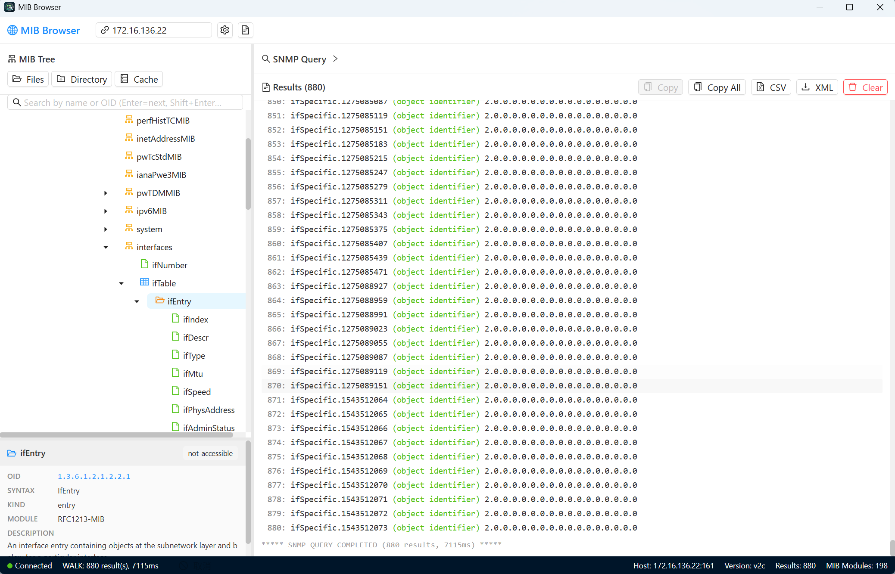
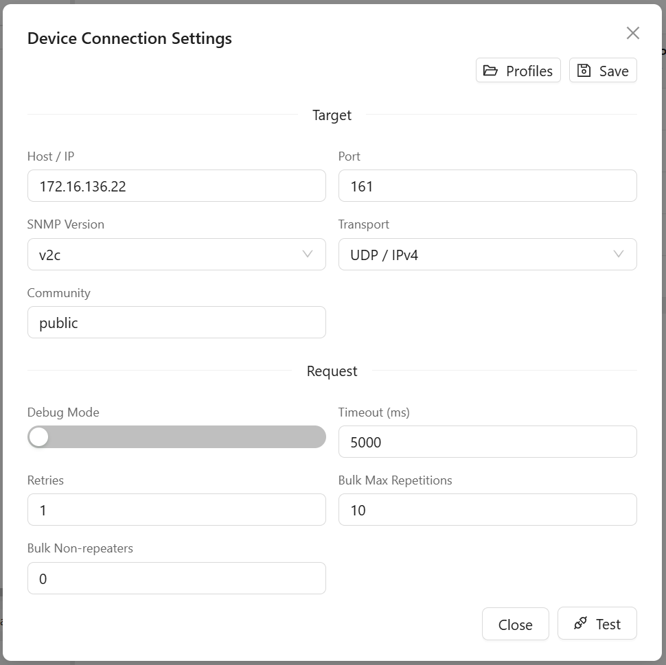

# MIB Browser

MIB Browser 是一个基于 Electron、React 和 TypeScript 构建的桌面 SNMP/MIB 工具。它用于加载厂商 MIB、浏览 MIB 树、执行 SNMP 查询，以及查看和编辑 SNMP 表。

项目目标很直接：减少手写 OID，让常见的设备查询、表数据检查和连接调试更顺手。

## 界面预览






## 主要能力

| 模块 | 能力 |
|---|---|
| MIB 加载 | 支持文件/目录加载、依赖顺序解析、缺失依赖诊断、缓存复用 |
| MIB 树 | 支持虚拟化浏览、搜索跳转、节点详情、右键 SNMP 操作 |
| SNMP 查询 | 支持 v1/v2c/v3、GET、GETBULK、WALK、BULK WALK、SET |
| 工具窗口 | GET、SET、Table Viewer 使用独立 Electron 工具窗口 |
| 表查看/编辑 | 自动识别 table/entry/columns/instance，支持过滤、排序、分页、复制、CSV 导出、基础 SET 编辑，以及 RowStatus 表的 Add Row / Delete Row |
| Trap / Inform 控制台 | 支持本地 UDP Trap/Inform 监听、启动/停止、实时事件查看、MIB 名称解析、过滤、复制、清空和自动滚动 |
| 连接配置 | 支持 Profiles，并自动恢复上次使用的完整设备配置 |
| Debug Logs | Debug Mode 开启后，可在应用内查看 SNMP/MIB/IPC 调试日志 |

## 快速开始

环境要求：

- Node.js 18 或更高版本
- npm 9 或更高版本
- Windows、macOS 或 Linux

安装依赖：

```bash
npm install
```

启动开发模式：

```bash
npm run dev
```

## 常用脚本

| 命令 | 说明 |
|---|---|
| `npm run dev` | 启动开发模式 |
| `npm run build` | 构建 main、preload、renderer 产物 |
| `npm run preview` | 预览构建后的应用 |
| `npm run typecheck` | 运行 node 和 web 类型检查 |
| `npm run lint` | 对 `src/` 运行 ESLint |
| `npm test` | 运行 Vitest 测试 |

提交前建议至少运行：

```bash
npm run typecheck
npm run lint
npm test
npm run build
```

## 使用说明

1. 加载 MIB：优先选择厂商 MIB 目录，应用会递归扫描常见 MIB 文件并按依赖顺序解析。
2. 配置设备：在连接设置中填写 Host/IP、端口、SNMP 版本、community 或 SNMPv3 参数。
3. 执行查询：可以手动输入 OID，也可以从 MIB 树节点右键发起 GET、SET、GETBULK、WALK、BULK WALK。
4. 查看表数据：对 `table` 或 `entry` 节点打开 Table Viewer，按行列查看实例数据。
5. 接收通知：打开 Trap / Inform Console，默认监听 `udp4:9162`；如需标准端口可改为 `162`，但部分系统需要管理员权限。
6. 调试问题：开启 Debug Mode 后，通过 Debug Logs 面板查看请求参数、耗时、错误和返回数量。

连接设置会自动记住上次使用的完整设备配置，包括 Host/IP、端口、SNMP 版本、认证信息、超时、重试、Bulk 参数和 transport。Profiles 仍用于保存多套命名配置。

## SNMPv3 支持

当前 SNMPv3 能力基于项目使用的 `net-snmp` 包：

| 类型 | 支持项 |
|---|---|
| Security Level | `noAuthNoPriv`、`authNoPriv`、`authPriv` |
| Auth Protocol | MD5、SHA-1、SHA-224、SHA-256、SHA-384、SHA-512 |
| Privacy Protocol | DES、AES-128、AES-256 Blumenthal、AES-256 Reeder |
| Transport | UDP/IPv4、UDP/IPv6 |

不支持的协议不会静默降级，创建 session 前会给出明确错误。

## 构建与打包

构建应用产物：

```bash
npm run build
```

使用 electron-builder 打包安装包：

```bash
npx electron-builder
```

构建输出：

- Electron/Vite 产物：`out/`
- 安装包产物：`dist/`

应用图标资源位于 `build/`。

## 项目结构

```text
my-mibbrowser/
├── build/                      # Electron builder resources and app icons
├── doc/png/                    # README screenshots
├── src/
│   ├── main/                   # Electron 主进程、IPC、MIB、SNMP、工具窗口
│   ├── preload/                # 暴露给 renderer 的 window.api
│   ├── renderer/               # React UI、状态、组件和样式
│   └── shared/                 # main/preload/renderer 共享类型
├── .trellis/                   # Trellis 任务、规范和工作记录
├── .agents/                    # 项目内 agent 技能
├── electron.vite.config.ts
├── electron-builder.json5
└── package.json
```

## 当前限制

- Agent Simulator 尚未实现。
- 实时图表和趋势分析尚未实现。
- SNMP over TCP、TLS/DTLS、TSM、DOCSIS DH 等不在当前 `net-snmp` 能力范围内。
- MIB 编译器已支持依赖解析和关键元数据保留，但还不是完整商业级 SMI 诊断器。
- Table Viewer 的 Add Row / Delete Row 仅支持带 RowStatus 语义的可创建/可删除表；复杂多阶段 createAndWait 流程仍是后续增强方向。

## 常见问题

### Electron 二进制下载失败

重新执行 `npm install`。仍失败时，可尝试：

```bash
node node_modules/electron/install.js
```

### MIB 加载后有大量依赖 warning

通常是当前目录缺少被 `IMPORTS ... FROM ...` 引用的基础 MIB。查看诊断详情，补齐缺失模块后重新加载目录。

### SNMPv3 认证或加密失败

检查 Security Level、Auth/Priv 协议、用户名、密码和 transport 是否与设备一致。必要时开启 Debug Mode 查看实际请求配置。

## 开发说明

本项目使用 Trellis 管理任务、代码规范和工作记录，项目规范见 `.trellis/spec/`。

## License

本项目按 GPL-3.0 协议发布。
