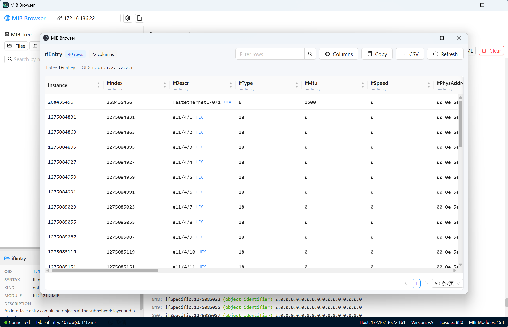

# MIB Browser

MIB Browser 是一个面向网络设备管理和 SNMP 调试的桌面工具。它基于 Electron、React 和 TypeScript 构建，重点不是做一个只能发送单条 OID 的简单客户端，而是把 MIB 加载、MIB 树浏览、SNMP 查询、表查看/编辑和调试日志放在同一个工作流里。

适合的使用场景：

- 加载厂商 MIB，解析依赖并浏览真实 MIB 树。
- 从 MIB 节点直接发起 GET、SET、GETBULK、WALK、BULK WALK。
- 查看和编辑 SNMP 表，减少手写 OID 和实例后缀。
- 调试设备连接、认证参数、请求耗时和返回数据。

## 界面预览

截图后续补充，建议保留以下路径和顺序：

<!--




-->

## 核心能力

| 模块 | 能力 |
|---|---|
| MIB 加载 | 支持文件/目录加载、依赖顺序解析、缺失依赖诊断、缓存复用 |
| MIB 树 | 虚拟化树浏览、搜索跳转、节点详情、右键 SNMP 操作 |
| SNMP 查询 | 支持 v1/v2c/v3、GET、GETNEXT、GETBULK、WALK、BULK WALK、SET |
| 工具窗口 | GET / SET / Table Viewer 使用独立 Electron 工具窗口 |
| 表查看/编辑 | 自动识别 table/entry/columns/instance，支持排序、过滤、复制、CSV 导出和基础 SET 编辑 |
| 连接配置 | 支持 profile，并自动恢复上次使用的完整设备连接配置 |
| Debug Logs | 应用内日志面板显示 SNMP/MIB/IPC 调试信息，支持复制、清空和自动滚动 |

## 快速开始

环境要求：

- Node.js 18 或更高版本
- npm 9 或更高版本
- Windows、macOS 或 Linux

安装依赖：

```bash
npm install
```

启动开发模式：

```bash
npm run dev
```

常用检查：

```bash
npm run typecheck
npm run lint
npm test
npm run build
```

## 使用流程

### 1. 加载 MIB

优先选择厂商 MIB 所在目录，而不是只加载单个文件。目录加载会递归扫描常见 MIB 文件扩展名，并按模块依赖顺序解析。若出现依赖 warning，可查看详情定位缺失模块和符号。

首次加载较大的 MIB 目录后会写入缓存，后续启动和浏览成本会降低。

### 2. 配置设备连接

在顶部连接设置中配置设备地址、端口、SNMP 版本、community 或 SNMPv3 用户/认证/加密参数。

应用会自动记住上次使用的完整连接配置，包括 Host/IP、端口、SNMP 版本、认证信息、超时/重试、Bulk 参数和 transport。Profiles 用于保存多套命名配置。

### 3. 发起 SNMP 操作

可以在 Query Panel 手动输入 OID，也可以从 MIB 树节点右键发起操作。推荐优先使用右键操作，减少手写 OID、实例后缀和表列解析错误。

支持的操作：

- `GET`
- `GETNEXT`
- `GETBULK`
- `WALK`
- `BULK WALK`
- `SET`

WALK / BULK WALK 会按 OID 段边界判断子树范围，避免把相邻子树误混进结果。

### 4. 查看和编辑 SNMP 表

对 `table` 或 `entry` 节点使用 Table Viewer。它会自动识别 entry、columns 和实例后缀，通过 WALK / BULK WALK 获取表数据，并按实例组装为行列结构。

Table Viewer 支持：

- 刷新、过滤、排序
- 列显隐
- 复制和 CSV 导出
- 可写列的基础编辑和 SNMP SET 提交
- 枚举、整数、字符串、IP、OID 等类型的基础输入转换

### 5. 调试连接问题

在连接设置中开启 Debug Mode，然后执行连接测试或 SNMP 请求。顶部工具栏的 Debug Logs 按钮可打开日志面板。

Debug Logs 面板会显示：

- SNMP 请求开始、结束、耗时、返回数量和错误
- SNMP 请求参数，包括 community、SNMPv3 密码和 SET 值
- MIB 文件/目录加载过程和解析摘要
- IPC 调用、工具窗口打开和主窗口结果回传

日志面板支持复制、清空和自动滚动，最多保留最近 500 条。Debug Mode 默认关闭；开启后可能显示敏感连接信息，只适合可信环境。

## SNMPv3 支持

当前 SNMPv3 能力基于项目使用的 `net-snmp` 包：

| 类型 | 支持项 |
|---|---|
| Security Level | `noAuthNoPriv`、`authNoPriv`、`authPriv` |
| Auth Protocol | MD5、SHA-1、SHA-224、SHA-256、SHA-384、SHA-512 |
| Privacy Protocol | DES、AES-128、AES-256 Blumenthal、AES-256 Reeder |
| Transport | UDP/IPv4、UDP/IPv6 |

不支持的协议不会静默降级到弱协议。创建 session 前会给出明确错误。

## 构建与打包

构建 Electron/Vite 产物：

```bash
npm run build
```

使用 electron-builder 打包安装包：

```bash
npx electron-builder
```

当前打包目标来自 `electron-builder.json5`：

| 平台 | 目标 |
|---|---|
| Windows | NSIS x64 |
| macOS | DMG x64 / arm64 |
| Linux | AppImage x64 |

构建输出：

- Electron/Vite 产物：`out/`
- 安装包产物：`dist/`

应用图标资源位于 `build/`：

- `build/icon.svg`：可编辑源文件
- `build/icon.png`：Linux 和运行时窗口图标
- `build/icon.ico`：Windows 打包图标
- `build/icon.icns`：macOS 打包图标

## 项目结构

```text
my-mibbrowser/
├── build/                      # Electron builder resources, including app icons
├── src/
│   ├── main/
│   │   ├── index.ts              # Electron 主进程入口
│   │   ├── ipc/                  # IPC handlers
│   │   ├── mib/                  # MIB parser、类型和缓存逻辑
│   │   ├── snmp/                 # SNMP session、协议映射和操作实现
│   │   ├── toolWindows.ts        # GET/SET/Table Viewer 工具窗口
│   │   └── debugLogger.ts        # Debug Mode 日志入口
│   ├── preload/
│   │   └── index.ts              # 暴露给 renderer 的 window.api
│   ├── renderer/
│   │   └── src/
│   │       ├── components/       # Toolbar、MIB 树、结果面板、工具窗口内容
│   │       ├── stores/           # Zustand 状态
│   │       ├── utils/            # 结果列、表数据、MIB 树工具
│   │       └── styles.css        # 全局样式
│   └── shared/                   # main/preload/renderer 共享类型
├── .trellis/                     # Trellis 任务、规范和工作记录
├── .agents/                      # 项目内 agent 技能
├── electron.vite.config.ts
├── electron-builder.json5
├── tsconfig.node.json
├── tsconfig.web.json
└── package.json
```

## 常见问题

### Electron 二进制下载失败

如果安装依赖后 Electron 可执行文件缺失，通常是 Electron postinstall 下载失败。先重新执行：

```bash
npm install
```

仍失败时，可尝试手动运行：

```bash
node node_modules/electron/install.js
```

### MIB 加载后有大量依赖 warning

这通常表示当前目录缺少被 `IMPORTS ... FROM ...` 引用的基础 MIB。

处理方式：

1. 打开诊断详情，查看缺失模块名。
2. 将缺失 MIB 文件放入同一目录或一起加载。
3. 重新加载目录。

### SNMPv3 认证或加密失败

检查以下内容：

- Security Level 是否与设备一致。
- Auth / Priv 协议是否与设备一致。
- 用户名、认证密码、加密密码是否正确。
- Transport 是否需要 IPv4 或 IPv6。
- 可临时开启 Debug Mode 查看实际请求配置。

## 当前限制

- Trap/Inform 控制台尚未实现。
- Agent Simulator 尚未实现。
- 实时图表和趋势分析尚未实现。
- SNMP over TCP、TLS/DTLS、TSM、DOCSIS DH 等不在当前 `net-snmp` 能力范围内。
- MIB 编译器已支持依赖解析和关键元数据保留，但还不是完整商业级 SMI 诊断器。
- Table Viewer 支持查看和基础编辑，Add Row / Delete Row 等高级表行生命周期操作仍是后续增强方向。

## 开发规范

本项目使用 Trellis 管理任务、代码规范和工作记录。重要约束包括：

- main 进程 SNMP 操作必须保持 session 清理和取消逻辑一致。
- OID 子树判断必须按段边界匹配，不能直接用裸 `startsWith`。
- renderer 发起 SNMP 操作后，结果必须通过统一结果会话写入路径展示。
- 大段诊断信息不能直接放入 toast，应使用短通知加详情视图。
- 业务代码不要散落 `console.log`，诊断输出走 Debug Mode 的集中 logger。

更多细节见 `.trellis/spec/`。

## License

本项目按 GPL-3.0 协议发布。复制、修改、分发以及基于本项目的衍生作品需要遵循 GPL-3.0 的源代码公开和同协议分发要求。
